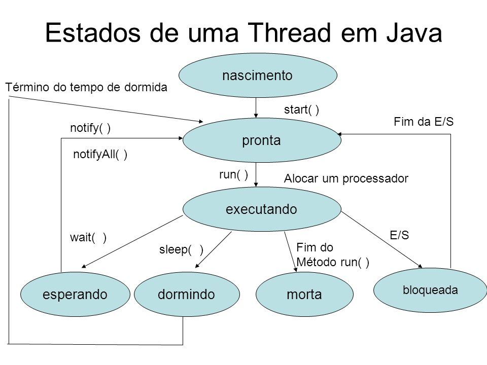

# Concorrência com Java

**Obs:** Este texto foi escrito por IA.

## Threads

### O que são threads no Java?

Threads no Java são pequenos subconjuntos de um programa maior que podem executar tarefas de forma independente e concorrente. Cada thread tem sua própria pilha de execução, mas compartilha o mesmo espaço de memória com outras threads no processo Java.

As threads no Java são usadas para realizar operações simultâneas, melhorar o desempenho e a capacidade de resposta de um programa e para facilitar tarefas assíncronas.

### Thread vs Runnable

Em Java, existem duas formas de criar e usar threads: estendendo a classe Thread ou implementando a interface Runnable.

Ao estender a classe Thread, uma classe herda todos os métodos e campos da classe Thread, mas fica limitada a estender apenas uma outra classe. Por outro lado, ao implementar a interface Runnable, uma classe pode definir seu próprio comportamento enquanto ainda pode estender outras classes, se necessário.

Ao usar a classe Thread, a classe deve sobrescrever o método `run()` para definir o código que será executado quando a thread for iniciada. Ao usar a interface Runnable, a classe deve implementar o método `run()`.

Ambas as abordagens permitem a execução concorrente de código, mas usar a interface Runnable oferece mais flexibilidade e reutilização.

É importante observar que as threads em Java são gerenciadas pela Máquina Virtual Java (JVM) e seu comportamento pode variar dependendo do sistema operacional subjacente.

### Thread.run() e Thread.start()

O método `run()` é um método regular da classe Thread que contém o código a ser executado quando a thread é iniciada. Ao chamar o método `run()`, o código é executado sequencialmente na thread atual, sem criar uma nova thread.

Por outro lado, o método `start()` é responsável por iniciar uma nova thread de execução. Ao chamar o método `start()`, a JVM cria uma nova thread e invoca automaticamente o método `run()` nessa nova thread. Isso permite que o código dentro do método `run()` seja executado de forma concorrente com outras threads.

Em resumo, chamar o método `run()` executa o código sequencialmente na thread atual, enquanto chamar o método `start()` cria uma nova thread e executa o código concorrentemente com outras threads.

### Como as threads funcionam dentro da JVM?

Dentro da JVM, as threads são executadas de forma concorrente e cooperativa. A JVM é responsável por gerenciar as threads e alocar tempo de execução para cada uma delas.

A JVM utiliza um modelo de agendamento de threads para determinar a ordem de execução das threads. Isso significa que a JVM decide quais threads devem ser executadas em determinado momento, com base em fatores como prioridade, sincronização e escalonamento.

Cada thread possui sua própria pilha de execução, que contém informações sobre as chamadas de método em andamento e as variáveis locais. As threads compartilham o mesmo espaço de memória, o que permite a comunicação e compartilhamento de dados entre elas.

No entanto, é importante mencionar que, embora as threads possam executar tarefas de forma concorrente, a ordem exata de execução e a alocação de tempo de CPU para cada thread são determinadas pelo sistema operacional subjacente.

Em resumo, as threads no Java funcionam dentro da JVM de forma concorrente e cooperativa, permitindo a execução simultânea de tarefas e melhorando o desempenho e a capacidade de resposta dos programas.

### Estados das Threads

Existem vários estados em que uma thread pode estar no Java:

- **New**: Quando uma thread é criada, mas ainda não foi iniciada usando o método `start()`.
- **Runnable**: Quando a thread está pronta para ser executada, mas ainda não está sendo executada por falta de tempo de CPU disponível.
- **Running**: Quando a thread está sendo executada atualmente pelo processador.
- **Blocked**: Quando a thread está aguardando a liberação de um monitor para acessar uma seção crítica, ou esperando por uma operação de E/S (entrada/saída) ser concluída.
- **Waiting**: Quando a thread está aguardando indefinidamente por outra thread para realizar uma determinada ação, como notificação ou interrupção.
- **Timed Waiting**: Quando a thread está aguardando por um tempo específico para que uma determinada ação ocorra.
- **Terminated**: Quando a thread conclui sua execução ou é interrompida.

A transição entre esses estados ocorre conforme as ações executadas pela própria thread ou por outras threads. Por exemplo, uma thread pode passar do estado Runnable para o estado Blocked se tentar acessar uma seção crítica já bloqueada por outra thread. Ou uma thread pode passar do estado Running para o estado Waiting se chamar o método `wait()`.

É importante observar que o comportamento exato e a transição de estados das threads podem depender do sistema operacional subjacente e de outros fatores, como sincronização e escalonamento.

Em resumo, as threads em Java podem estar em diferentes estados, cada um com um significado específico e relações de transição entre eles, permitindo a execução concorrente e cooperativa de tarefas.

Aqui está um diagrama que representa os estados das threads em Java:



### Prioridade das threads

A prioridade das threads em Java é usada para determinar a ordem de execução quando múltiplas threads estão prontas para serem executadas. Cada thread possui uma prioridade, que é um valor inteiro entre 1 e 10, sendo 1 a prioridade mais baixa e 10 a mais alta.

A JVM usa a prioridade das threads como uma sugestão para o sistema operacional, mas a implementação exata da prioridade pode variar dependendo do sistema operacional subjacente. Em geral, uma thread de maior prioridade tem mais chances de ser executada antes de uma thread de menor prioridade, mas não há garantia de que isso ocorrerá em todas as situações.

Os valores de prioridade padrão das threads são definidos nas constantes estáticas da classe Thread: MIN_PRIORITY (1), NORM_PRIORITY (5) e MAX_PRIORITY (10). Uma thread é criada com a prioridade normal (NORM_PRIORITY) por padrão, mas pode ser alterada usando o método `setPriority()`.

É importante observar que a prioridade das threads deve ser usada com cuidado, pois um uso incorreto ou excessivo das prioridades pode levar a problemas de escalonamento e desempenho. Em geral, é recomendado usar as prioridades padrão e deixar o sistema operacional gerenciar a ordem de execução das threads.

### Thread.yield()

O método `Thread.yield()` é usado para indicar que a thread atual está disposta a ceder o processador e permitir que outras threads sejam executadas. Ele é uma sugestão para o escalonador de threads de que pode ser um bom ponto para realizar uma troca de contexto.

Quando `Thread.yield()` é chamado, a thread atual passa do estado Running para o estado Runnable, permitindo que outras threads tenham a chance de serem executadas. No entanto, não há garantia de que a chamada a `Thread.yield()` resultará na troca real de contexto para outra thread. Isso ocorre porque a decisão final de qual thread será executada é determinada pelo escalonador do sistema operacional.

O uso de `Thread.yield()` geralmente é útil quando há uma necessidade de dar oportunidade a outras threads de serem executadas em um ambiente de múltiplas threads concorrentes. No entanto, é importante observar que o uso excessivo de `Thread.yield()` pode levar a problemas de desempenho, pois a troca de contexto frequente pode causar sobrecarga desnecessária. Portanto, o método `Thread.yield()` deve ser usado com cuidado e em situações adequadas.

Em resumo, o método `Thread.yield()` é usado para indicar que a thread atual está disposta a ceder o processador para outras threads, permitindo a execução concorrente e cooperativa de várias threads.

### Thread.join()

Quando uma thread chama o método `join()` em outra thread, a thread atual entra no estado Blocked e aguarda até que a thread em que `join()` foi chamado termine sua execução. Durante esse período de espera, a thread atual não consome recursos do processador, permitindo que outras threads sejam executadas.

Assim que a thread alvo do `join()` termina sua execução, a thread atual é desbloqueada e pode continuar sua execução a partir do ponto em que estava antes de chamar `join()`. Isso garante a ordem de execução e sincronização entre as threads, pois a thread atual não avança até que a thread alvo seja concluída.

O método `join()` também pode ser usado com um limite de tempo. Nesse caso, a thread atual aguarda apenas por um determinado período de tempo até que a thread alvo termine. Se a thread alvo não terminar dentro desse limite de tempo, a thread atual é desbloqueada automaticamente e pode continuar sua execução.

O uso do método `join()` é útil quando você precisa garantir a conclusão de um conjunto específico de threads antes que a thread atual possa prosseguir. Isso é especialmente importante em cenários em que a ordem de execução das threads é crucial ou quando a thread atual depende dos resultados das outras threads.

### Sincronismo de threads

Quando duas threads acessam o mesmo objeto simultaneamente, podem surgir problemas relacionados à concorrência e sincronização. Esses problemas incluem:

1. Condição de corrida: Uma condição de corrida ocorre quando duas ou mais threads tentam acessar ou modificar o mesmo objeto ao mesmo tempo. Isso pode levar a resultados inesperados, como valores incorretos, inconsistências nos dados ou comportamento indefinido. Por exemplo, se duas threads tentarem atualizar o mesmo contador ao mesmo tempo, o valor final do contador pode não ser o esperado.
2. Atualização incorreta: Quando duas threads tentam atualizar o mesmo objeto simultaneamente, podem ocorrer atualizações incorretas. Isso pode acontecer quando uma thread lê o valor atual do objeto, realiza algum processamento e, em seguida, atualiza o valor com base nesse processamento. Se outra thread modificar o objeto entre a leitura e a atualização, a primeira thread pode usar um valor desatualizado e produzir resultados incorretos.
3. Condição de corrida de escrita-leitura: Uma condição de corrida de escrita-leitura ocorre quando uma thread está escrevendo em um objeto enquanto outra thread está lendo o mesmo objeto. Isso pode levar a resultados inconsistentes ou valores corrompidos. Por exemplo, se uma thread estiver escrevendo um novo valor em uma variável, enquanto outra thread estiver lendo o valor atual dessa variável, a segunda thread pode obter um valor inconsistente ou incorreto.
4. Deadlock: O deadlock é uma situação em que duas ou mais threads ficam bloqueadas indefinidamente, aguardando um recurso que nunca será liberado. Isso ocorre quando as threads adquirem bloqueios em objetos e aguardam a liberação de outros bloqueios para prosseguir. Se as threads não liberarem os bloqueios corretamente ou se houver um conflito de dependências entre os bloqueios, um deadlock pode ocorrer, impedindo o progresso do programa.

Para evitar esses problemas, é necessário implementar mecanismos de sincronização, como o uso de bloqueios (como a palavra-chave `synchronized` em Java) ou o uso de objetos de monitor. Esses mecanismos garantem que apenas uma thread por vez possa acessar ou modificar o objeto compartilhado, evitando condições de corrida e mantendo a consistência dos dados.

### Thread Safe

As classes "thread safe" são classes que podem ser usadas de forma segura em ambientes com várias threads, sem a necessidade de sincronização externa para evitar condições de corrida. Essas classes são projetadas para garantir que operações concorrentes em seus objetos sejam executadas corretamente e sem erros.

Algumas classes "thread safe" em Java incluem:

1. `java.util.concurrent.ConcurrentHashMap`: É uma implementação da interface `Map` que permite acesso e atualização simultâneos de várias threads sem a necessidade de sincronização externa. Ela garante que as operações de leitura e gravação sejam executadas corretamente e sem conflitos.
2. `java.util.concurrent.CopyOnWriteArrayList`: É uma implementação da interface `List` que fornece acesso e iteração seguros em ambientes concorrentes. Ela garante que as operações de leitura sejam executadas de forma consistente, enquanto as operações de gravação criam uma cópia do array subjacente, evitando conflitos de escrita.
3. `java.util.concurrent.atomic.AtomicInteger`: É uma classe que fornece operações atômicas para variáveis do tipo `int`. Ela garante que as operações de incremento, decremento e atualização sejam executadas de forma atômica, sem a necessidade de sincronização externa.
4. `java.util.concurrent.locks.ReentrantLock`: É uma implementação da interface `Lock` que fornece um mecanismo de bloqueio reentrante. Ela permite que várias threads acessem um recurso compartilhado, desde que a thread atual já possua o bloqueio. Isso evita bloqueios indefinidos e permite que as threads concorrentes acessem o recurso de forma segura.

Essas são apenas algumas exemplos de classes "thread safe" em Java. Existem muitas outras classes e estruturas de dados disponíveis na biblioteca `java.util.concurrent` que são projetadas para suportar operações concorrentes de forma segura.

### wait(), notify() e notifyAll()

O funcionamento dos métodos `wait()`, `notify()` e `notifyAll()` está relacionado à sincronização de threads em Java.

- **wait()**: O método `wait()` é usado para fazer com que uma thread atual aguarde até que outra thread chame o método `notify()` ou `notifyAll()` no mesmo objeto monitor. Quando uma thread chama `wait()`, ela libera o objeto monitor e entra em um estado de espera até que seja notificada. Isso permite que outras threads executem enquanto a thread atual aguarda a notificação.
- **notify()**: O método `notify()` é usado para notificar uma única thread que está aguardando em um objeto monitor. Quando uma thread chama `notify()`, ela notifica uma thread que está em espera para acordar e verificar se as condições necessárias foram atendidas. Após a notificação, a thread notificada entra no estado Runnable e pode competir para adquirir o objeto monitor.
- **notifyAll()**: O método `notifyAll()` é usado para notificar todas as threads que estão aguardando em um objeto monitor. Semelhante ao `notify()`, ele desperta as threads em espera, mas notifica todas elas em vez de apenas uma. Após a notificação, todas as threads notificadas entram no estado Runnable e competem para adquirir o objeto monitor.

Esses métodos são usados em conjunto com o conceito de monitores em Java, que são usados para sincronizar o acesso a objetos compartilhados entre threads. Ao usar `wait()`, `notify()` e `notifyAll()`, as threads podem cooperar e coordenar suas atividades de forma segura, evitando condições de corrida e garantindo a sincronização adequada.

É importante observar que o uso correto desses métodos requer um cuidado especial na sincronização dos objetos compartilhados. É necessário garantir que as threads estejam aguardando e notificando corretamente nos mesmos objetos monitor para evitar problemas de bloqueio ou comportamento indefinido.

## Concorrência

### **AtomicInteger**

A classe **AtomicInteger** em Java é uma ferramenta poderosa para lidar com operações **thread-safe** em um contador inteiro. O **AtomicInteger** é usado quando precisamos realizar operações atômicas em um valor inteiro compartilhado por **diferentes threads** simultaneamente. Também fornece uma maneira de atualizar o valor de forma segura, sem a necessidade de sincronização manual.

O **AtomicInteger** protege um valor inteiro subjacente. Ele oferece métodos que realizam operações atômicas no valor, como incremento, decremento, adição, subtração, etc. Essas operações são executadas de forma **segura** em relação a **concorrência** entre threads. A classe **AtomicInteger** é parte do pacote **java.util.concurrent.atomic** desde o Java 1.5. 

### Lock

A **interface Lock** em Java é uma ferramenta poderosa para lidar com sincronização de threads de forma mais flexível do que o tradicional bloco **synchronized**. 

A **interface Lock** é usada quando precisamos controlar o acesso a um recurso compartilhado por **múltiplas threads**. Ela oferece operações mais extensas do que as obtidas com blocos **synchronized**. Diferentemente do **synchronized**, a **Lock** permite estruturar o código de forma mais flexível e suporta múltiplos objetos **Condition** associados.

**Diferenças entre Lock e Bloco synchronized**:

- Um bloco **synchronized** está contido dentro de um método. Já com a **Lock**, podemos ter operações de **lock()** e **unlock()** em métodos separados.
- O **synchronized** não suporta justiça (fairness). Qualquer thread pode adquirir o lock assim que for liberado, sem preferência. A **Lock** permite especificar justiça, garantindo que a thread que espera há mais tempo tenha acesso ao lock.
- O **synchronized** bloqueia a thread se não conseguir adquirir o lock. A **Lock** oferece o método **tryLock()**, que tenta adquirir o lock sem bloquear a thread.
- A **Lock** também permite interromper uma thread em espera com **lockInterruptibly()**.

**Métodos da Interface Lock**:

- `void lock()`: Adquire o lock se estiver disponível. A thread fica bloqueada até que o lock seja liberado.
- `void lockInterruptibly()`: Similar ao **lock()**, mas permite interromper a thread em espera.
- `boolean tryLock()`: Versão não bloqueante do **lock()**. Retorna verdadeiro se o lock for adquirido.
- `boolean tryLock(long timeout, TimeUnit timeUnit)`: Espera até o tempo limite antes de desistir de adquirir o lock.
- `void unlock()`: Libera o lock. Sempre desbloqueie o lock para evitar deadlocks.

**Exemplo de Uso**:

```java
import java.util.concurrent.locks.Lock;
import java.util.concurrent.locks.ReentrantLock;

public class ExemploLock {
    public static void main(String[] args) {
        Lock lock = new ReentrantLock();

        lock.lock();
        try {
            // Acesso ao recurso compartilhado
        } finally {
            lock.unlock();
        }
    }
}
```

**Observações**:

- A ausência de escopo estruturado na **Lock** requer cuidado para liberar o lock corretamente.
- Use o padrão com **try-finally** para garantir a liberação adequada do lock.

### Executors

A classe `ExecutorService` é uma API que fornece um mecanismo para executar tarefas assíncronas em Java. Ela é uma abstração ao controle manual de threads para execução de um conjunto de operações assíncronas. O objetivo é tornar o desenvolvimento assíncrono mais amigável e menos propenso a erros, sem necessidade de sincronização manual.

Um tipo específico de ExecutorService é aquele que possui um thread pool (`ThreadPoolExecutor`). Um thread pool é um tipo de reservatório de threads, que ficam à espera de um trabalho a fazer. Lembrando que uma thread em Java é representada por uma instância da classe Thread.

**`newFixedThreadPool(int nThreads)`**: Cria um pool de threads com um número fixo de threads. O número de threads é especificado pelo parâmetro **`nThreads`**. As threads são reutilizadas para executar tarefas subsequentes. Se todas as threads estiverem ocupadas, as tarefas subsequentes aguardam na fila até que uma thread esteja disponível. Esse método é útil quando você tem um número fixo de tarefas a serem executadas e deseja limitar o número de threads em execução simultaneamente.

**`newSingleThreadExecutor()`**: Cria um pool de threads com uma única thread. Todas as tarefas são executadas sequencialmente por essa única thread. Esse método é útil quando você deseja garantir que as tarefas sejam executadas em uma ordem específica.

**`newCachedThreadPool()`**: Cria um pool de threads que cria novas threads conforme necessário, mas reutiliza threads previamente criadas quando estão disponíveis. Esse método é útil quando você tem muitas tarefas curtas a serem executadas e deseja evitar o custo de criar uma nova thread para cada tarefa.

A classe **`ScheduledExecutorService`** é uma subinterface de **`ExecutorService`** que permite agendar a execução de tarefas em um determinado momento ou em intervalos regulares de tempo. A interface fornece três métodos principais para agendar tarefas:

1. **`schedule(Callable<V> callable, long delay, TimeUnit unit)`**: Cria e executa um **`ScheduledFuture`** que se torna habilitado após o atraso especificado.
2. **`schedule(Runnable command, long delay, TimeUnit unit)`**: Cria e executa uma ação única que se torna habilitada após o atraso especificado.
3. **`scheduleAtFixedRate(Runnable command, long initialDelay, long period, TimeUnit unit)`**: Cria e executa uma ação periódica que se torna habilitada pela primeira vez após o atraso inicial especificado e subsequentemente com o período especificado.

Os métodos **`scheduleAtFixedRate`** e **`scheduleWithFixedDelay`** criam e executam tarefas que são executadas periodicamente até serem canceladas. Os comandos enviados usando os métodos **`Executor.execute(Runnable)`** e **`ExecutorService.submit(Runnable)`** são agendados com um atraso solicitado de zero. A interface **`ScheduledExecutorService`** é fornecida na biblioteca padrão do Java e pode ser usada para agendar tarefas em um programa Java.

A interface Callable é uma interface genérica introduzida no Java 5.0 que contém um único método call() que retorna um valor genérico V. Por outro lado, a interface Runnable é uma interface funcional que contém um único método run() que não aceita nenhum parâmetro ou retorna nenhum valor.

Ambas as interfaces são projetadas para representar uma tarefa que pode ser executada por várias threads. No entanto, existem algumas diferenças entre elas:

- **Mecanismo de execução**: podemos executar tarefas **Runnable** usando a classe **Thread** ou **ExecutorService**, enquanto podemos executar apenas tarefas **Callable** usando o último.
- **Valores de retorno**: a interface **Runnable** não retorna nenhum valor, enquanto a interface **Callable** retorna um valor genérico V.
- **Tratamento de exceções**: como o método **run()** da interface **Runnable** não tem a cláusula “throws” especificada, não temos como propagar exceções verificadas. Por outro lado, o método **call()** da interface **Callable** contém a cláusula “throws Exception”, portanto, podemos propagar facilmente exceções verificadas.

### Future

A classe **Future** no Java é uma ferramenta poderosa para processamento assíncrono e paralelo. Vamos explorar como ela funciona e quais são seus principais métodos:

1. **Future**:
    - A classe **Future** encapsula uma chamada feita em paralelo, permitindo que você execute tarefas assíncronas.
    - Principais métodos:
        - `get()`: Aguarda a conclusão da tarefa e retorna o resultado (ou lança exceções se ocorrerem).
        - `isDone()`: Verifica se a execução já terminou.
        - `cancel(boolean mayInterruptIfRunning)`: Cancela a execução da tarefa.
        - `get(long timeout, TimeUnit unit)`: Aguarda a conclusão da tarefa por um tempo específico.
        - `isCancelled()`: Verifica se a tarefa foi cancelada.
2. **FutureTask**:
    - É uma implementação da interface **Future** que pode ser executada em paralelo.
    - Permite as mesmas verificações que fazemos com a interface **Future**.
3. **Callable**:
    - Interface para a implementação de execuções em paralelo.
    - Semelhante à interface **Runnable**, mas a **Callable** deve retornar um valor ao final da execução.
4. **ExecutorService**:
    - Gerencia execuções em paralelo, criando um pool de threads.
    - Inicia e cancela as execuções.
    - Evita a criação excessiva de novas tarefas.

Para demonstrar na prática, aqui está um exemplo simples utilizando a classe **Future** e **Callable**:

```java
import java.util.concurrent.Callable;
import java.util.concurrent.ExecutorService;
import java.util.concurrent.Executors;
import java.util.concurrent.Future;

public class ExemploProcessamentoAssincrono {
    private static final ExecutorService threadpool = Executors.newFixedThreadPool(3);

    public static void main(String[] args) throws Exception {
        Callable<Integer> tarefa1 = () -> 42; // Exemplo de tarefa que retorna um valor
        Callable<Integer> tarefa2 = () -> 100;
        Callable<Integer> tarefa3 = () -> 7;

        Future<Integer> futureT1 = threadpool.submit(tarefa1);
        Future<Integer> futureT2 = threadpool.submit(tarefa2);
        Future<Integer> futureT3 = threadpool.submit(tarefa3);

        while (!futureT1.isDone() || !futureT2.isDone() || !futureT3.isDone()) {
            System.out.println("Aguardando tarefas...");
        }

        int resultado = futureT1.get() + futureT2.get() + futureT3.get();
        System.out.println("Resultado final: " + resultado);

        threadpool.shutdown();
    }
}

```

Lembre-se de adaptar esses conceitos às suas necessidades específicas. As classes **Future** e **Callable** são ferramentas valiosas para lidar com processamento assíncrono e paralelo no Java.

### CompletableFuture

A classe `CompletableFuture` é uma classe introduzida no Java 8 que permite a criação de programas assíncronos e reativos. Ela é uma mônada que encapsula valores e/ou computações, permitindo a execução de tarefas em segundo plano sem bloquear a thread principal, tornando a execução de operações demoradas mais eficiente.

A classe `CompletableFuture` possui diversos métodos que permitem a realização de operações assíncronas, como `thenApply()`, `thenAccept()`, `thenRun()`, `thenCompose()`, `thenCombine()`, `allOf()`, `anyOf()`, entre outros.

O método `thenApply()` é utilizado para aplicar uma função ao resultado de uma `CompletableFuture`. O método `thenAccept()` é utilizado para consumir o resultado de uma `CompletableFuture`. O método `thenRun()` é utilizado para executar uma ação após a conclusão de uma `CompletableFuture`. O método `thenCompose()` é utilizado para encadear duas `CompletableFutures`. O método `thenCombine()` é utilizado para combinar o resultado de duas `CompletableFutures`. O método `allOf()` é utilizado para combinar múltiplas `CompletableFutures` em uma única `CompletableFuture`. O método `anyOf()` é utilizado para retornar a primeira `CompletableFuture` que for concluída.

**Boas práticas ao usar CompletableFuture com Streams**

Aqui estão algumas boas práticas para usar `CompletableFuture` com a API de `Streams` do Java:

1. **Evite bloqueios**: A API de `Streams` do Java é projetada para ser usada em operações assíncronas e não bloqueantes. Portanto, evite bloqueios em operações de `CompletableFuture` para garantir que a execução do programa seja eficiente e responsiva.
2. **Use `thenApply()` para transformar resultados**: O método `thenApply()` é útil para transformar o resultado de uma `CompletableFuture` em outro objeto. Ele retorna uma nova `CompletableFuture` que contém o resultado transformado.
3. **Use `thenCompose()` para encadear operações**: O método `thenCompose()` é usado para encadear duas ou mais operações de `CompletableFuture`. Ele retorna uma nova `CompletableFuture` que contém o resultado da última operação.
4. **Use `allOf()` para combinar múltiplas `CompletableFutures`**: O método `allOf()` é usado para combinar múltiplas `CompletableFutures` em uma única `CompletableFuture`. Ele retorna uma nova `CompletableFuture` que contém os resultados de todas as `CompletableFutures` combinadas.
5. **Use `anyOf()` para retornar a primeira `CompletableFuture` concluída**: O método `anyOf()` é usado para retornar a primeira `CompletableFuture` que for concluída. Ele retorna uma nova `CompletableFuture` que contém o resultado da primeira `CompletableFuture` que for concluída.